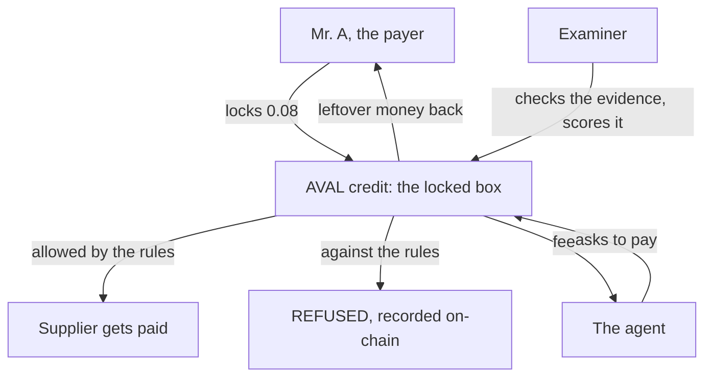
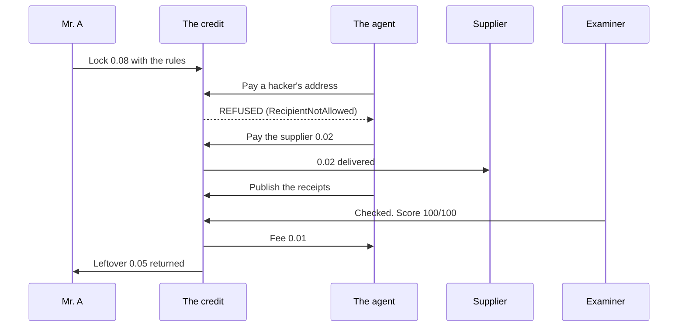

# How it works

**In one sentence: don't give an AI agent your wallet. Give it a prepaid,
restricted card instead.**

That is all AVAL is. You put money in a locked box with rules on it. The agent
can only spend from the box, only by the rules, and gets paid its own fee only
after an independent checker confirms the job was really done. If the agent
(or a hacker inside it) tries anything else, the blockchain says **REFUSED**
and keeps a permanent record of the attempt.

## The bank card analogy

Imagine you have $800 and you hire someone to buy supplies.

**Option A:** give them your bank card and PIN. If they go rogue or get
hacked, all $800 is at risk.

**Option B:** give them a prepaid card that says: *up to $200 per purchase,
only at Supplier X, only for the next 72 hours.* If anyone tries to use it
anywhere else, the card simply says **DECLINED**.

AVAL is Option B, built with smart contracts, for software that spends money.

## Who is involved

| Who | In plain terms |
| --- | --- |
| **The payer** (applicant) | The person putting up the money |
| **The agent** | The bot that does the job. It never holds the money |
| **The examiner** | An independent checker both sides trust |
| **The credit** | The locked box itself: a smart contract holding the money and enforcing the rules |

## The story of Mr. A

Mr. A owns an electronics shop. A bot pays his suppliers overnight. He will
not give the bot his wallet, because a hacked bot with a wallet can take
everything. So he uses AVAL.

**1. He locks the money.** Mr. A puts 0.08 into a credit. Inside, 0.07 is
working money for the job and 0.01 is reserved as the bot's fee. The bot
holds none of it. The box does.

**2. He writes the rules.** The bot may only call the payment function on his
approved supplier's contract, at most 0.02 per payment, and the whole thing
expires in 72 hours. The bot cannot pay anyone else, cannot take the full
amount, and cannot use the permission forever.

**3. The bot gets hacked.** On Tuesday night a hacker inside the bot tries to
send money to his own address. The box checks the rules and answers:
**RecipientNotAllowed**. The payment fails. The hacker paid a fee for the
attempt and got nothing. Mr. A was asleep the whole time, and that is the
point: he never had to catch it. The rules are not a security camera watching
the money. The rules ARE the money's custody.

**4. The fixed bot does the real job.** It pays the supplier 0.02. Approved
supplier, approved function, under the per-payment cap, before the deadline.
The box lets it through.

**5. The bot shows its receipts.** It publishes its evidence on the chain:
which invoice, how much, which transaction. The box will reject any evidence
that does not match its recorded fingerprint, so receipts cannot be swapped
later.

**6. The examiner checks. The bot does not mark its own homework.** The
examiner independently reads the supplier's own contract, confirms the
invoice was really paid, and scores the job 100 out of 100. Below the score
threshold Mr. A set (75), the bot's fee simply cannot be paid.

**7. Everyone gets settled.** Of the original 0.08: the supplier got 0.02,
the bot earns its 0.01 fee, and the unused 0.05 goes back to Mr. A
automatically.

**8. The bot earns a track record.** The settlement writes a score into the
agent's on-chain reputation (an open standard called ERC-8004). Only a credit
that actually paid out can write that entry. So when Mr. A compares agents
next year, "200 settled jobs" means 200 verified, paid, independently checked
jobs. Not 200 five-star reviews.

## Why the refusal matters so much

Most systems log what an agent did and hope someone reads the log in time.
AVAL is different: a forbidden payment does not happen and then get noticed.
It **never happens**. And the attempt itself is stored in a block forever,
with the reason, where anyone can see it. On this site, every crimson entry
in a credit's timeline is one of those recorded refusals. Click one and the
blockchain explorer shows you: status, failed; money moved, none.

## What AVAL does and does not promise

Honesty about the fine print:

- The rules control **where** money can go and **which** functions can be
  called, with per-payment and total caps. They do not yet inspect the
  arguments inside a call, so today's safe pattern is naming suppliers and
  simple payment functions, not complex things like trading routers.
- The examiner is someone the payer **chose to trust**, like the bank in a
  traditional letter of credit. The chain proves who scored what. It cannot
  prove the examiner was honest.
- Money already paid to an approved destination is spent. A dispute decides
  whether the agent earns its fee, not whether approved payments come back.

## The name

"Per aval" is an old trade-finance phrase: a guarantee someone signs onto a
bill of exchange, meaning *someone stands behind this payment*. That is what
the credit does for an AI agent, so that is the name. The technical deep dive,
including the chain research behind the project, lives in
[BOT Chain research](docs/RESEARCH.md), and a hands-on walkthrough is in
[Using the dapp](docs/GUIDE.md).
